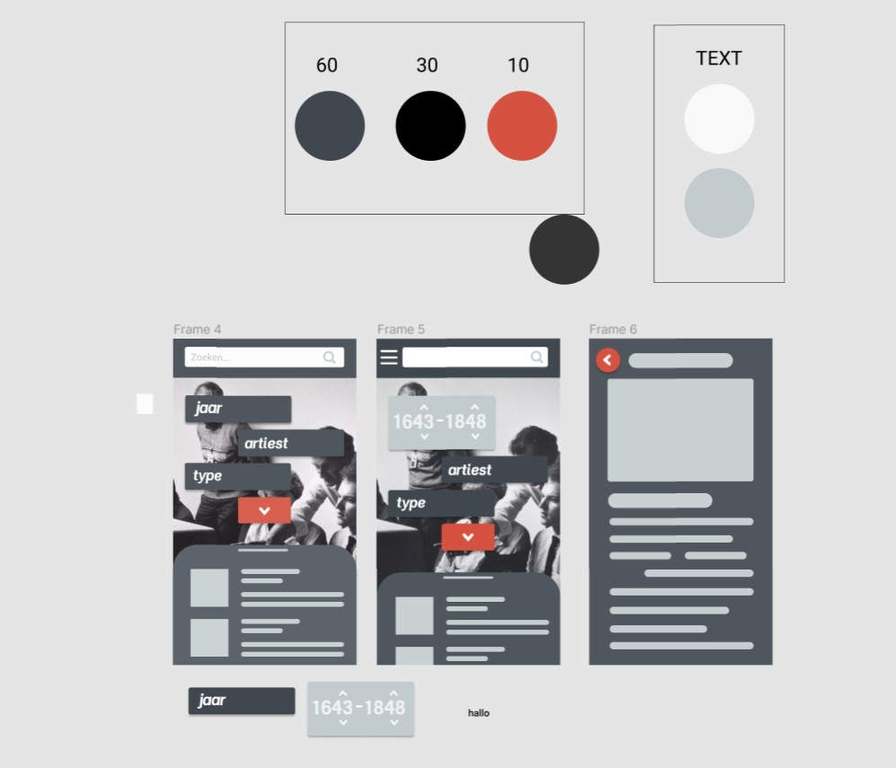
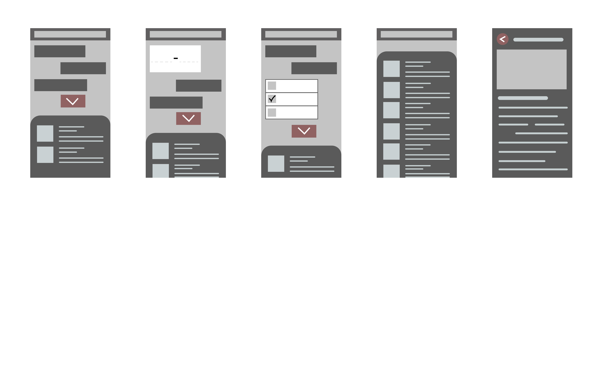

# Rijksmuseum README

For the course **WAFS** (Web App From Scratch), we were given a few options to chose from for our end project.
I chose the 'Rijksmuseum API' with the following user story:

_As an art lover, I want to be able to search and view art from the Rijksmuseum at home, so that I can still enjoy art during a lockdown._

In this Readme I will be discussing the ups and downs that I had during this project and also what the most and hardest challenges were.

# Week 2

**Day 1**

In day 1 I chose the API of the Rijksmuseum, Immediately i started sketching ideas on paper (picture 1) and in my head I was already designing the final concept with the funcitons I wanted to include.
I always like to finalise my sketches first before starting because then I have a more clearer vision of what do to and i can follow a clear structure for myself.

After having the sketches done, and finalized using the styling of the Rijksmuseum website, I started to look at how to pull the data from the API. Together with the people from my table, we took a look at it.
Since my JavaScript skills aren't that great I was basically lookin at what they did and discussing why they did what they did and reflecting that on my own JavaScript. In day 1 we managed to get the link to work and pull data from the API. We also saw our first challenge, which was to combine certain fetches.

```
 export function getData() {
  fetch(rijksAPI)
    .then(function (response) {
      return response.json();
    })
    .then(function (collection) {
      console.log(collection);
      const skeleton = $("ul.empty-list");
      console.log(skeleton);
      skeleton.classList.toggle("hidden");
      for (let i = 0; i < collection.artObjects.length; i++) {
        fetch(
          "https://www.rijksmuseum.nl/api/nl/collection/" +
            collection.artObjects[i].objectNumber +
            "?key=8Rynz75W&p=0-n&ps=10&imgonly=true"
        )
          .then(function (response) {
            return response.json();
          })

          .then(function (detailed) {
            render(detailed);
          });
      }
    });
}
```

**Day 2**

As you can see in the Code block above, we managed to combine 2 fetches becuase we needed certain Data from a different link.
In day 2, I started to create the HTML and CSS for the design that I made, (picture 2) and quickly saw that the initial design I had was too complicated, so I simplified the design more to the design seen in picture 2.

in the beginning of class we were given information about the different states of a webpage _(loading state, error state, etc.)_. I wanted to implement a loading state to my design as well and chose to do a skeleton state. I created the HTML for it in another <section> element and styled it using CSS.
As you can see in the code block above, the skeleton state is being shown first before the fetching of the data and inserting of the render HTML happens.

```
export function render(detailed) {
  list.insertAdjacentHTML(
    "beforebegin",
    `<a href="#information">
    <li>
    
    <h1>${detailed.artObject.dating.sortingDate}</h1>
    <h1>${detailed.artObject.title}</h1>
    </li></a>
    `
  );
}
```

# Week 3

Week 3 was all about refactoring your code and making it more readable and understandable using possibly, modules and micro libraries.
I chose to do the modules, since for my that was the best option becuase I had multiple functions in 1 file and was going to add even more.
I read into it and understood it, but wasnt really to implement it to my code.

After some more reading and testing i got it to work using 1 _main.js_, _getData.js_ and a _render.js_. I exported the functions and imported them into the main.js.

```
import { getData } from "./modules/getdata.js";

getData();

```

As you can see, render.js isnt being imported in the main, but rather it is imported in the getData.js since thats were we need the render function. So basically it goes like this:

**(render.js ==> getData.js) ==> main.js**

I also started on the filter systems since I wanted to have certain animations and transitions for the filter buttons. I created another JavaScript file for the Year button function and imported that into the main.js
For the year function, I created a function were, if you click on the year filter, you open another block (which is bigger wider and different styling) and that contained 2 number inputs for a Max and Min year.

```
export function jaar() {
  const jaarButton = $(".jaar-button");
  const jaarInvoer = $(".jaar-open");
  const form = $("form");

  form.addEventListener("submit", function (e) {
    e.preventDefault();
  });

  jaarButton.addEventListener("click", function (e) {
    console.log(e);
    e.preventDefault();
    jaarButton.classList.toggle("hidden");
    jaarInvoer.classList.toggle("hidden");
    console.log(jaarButton);
  });
}
```

So that it looks like the design that i created in Figma.

**Day 2**

In day 2, i was getting pretty lost and confused about what to do and got stuck at certain points like:

- Getting the search bar to work.
- Applying the filters.
- Making the design responsive.
- Adding a next page and previous page function.

But in the end i managed to get some things to work.
If you clicked on the < next page > buttons, something happend as seen in the Console. But i couldnt get the link to adjust yet when clicking on next page.
In the API link you could ass **p=0-n** which stood for pagenumber, and if you increase that number, the following "page" loads. It basically loads 10 new items and rids the previous 10.

I also got the search bar to work so that if you search on a name, year, artwork or type. It actually shows up in the Console, but it isnt displayed in the HTML yet. This is going to be my main vision and challenge for the last week of this course.

```
export function search() {
  const searchForm = $("header form");
  const searchInput = $("header input");
  const searchAPI =
    "https://www.rijksmuseum.nl/api/nl/collection?key=8Rynz75W&q=";

  function searchItems(e) {
    fetch(searchAPI + searchInput.value)
      .then(function (response) {
        return response.json();
      })
      .then(function (collection) {
        console.log(collection);
      });
    e.preventDefault();
  }
  searchForm.addEventListener("submit", searchItems);

  function $(element) {
    return document.querySelector(element);
  }
}
```

# Pictures

_Picture 3_

</img>

_Flow Chart_

</img>
